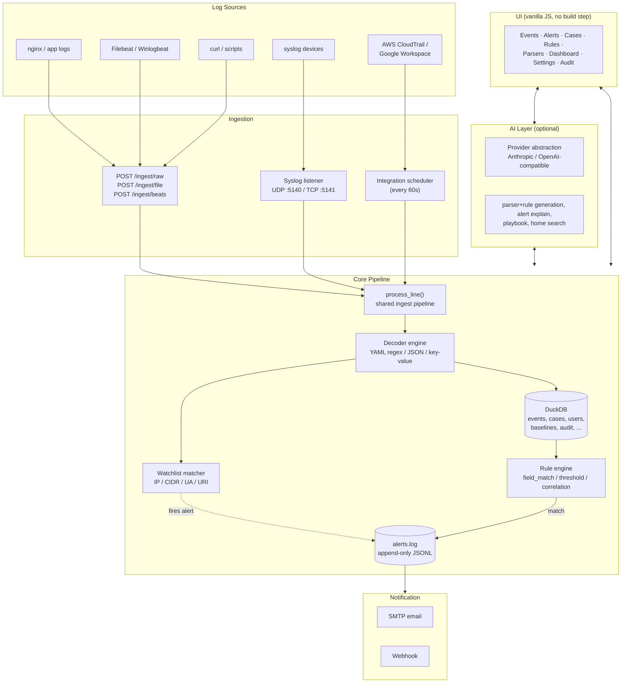
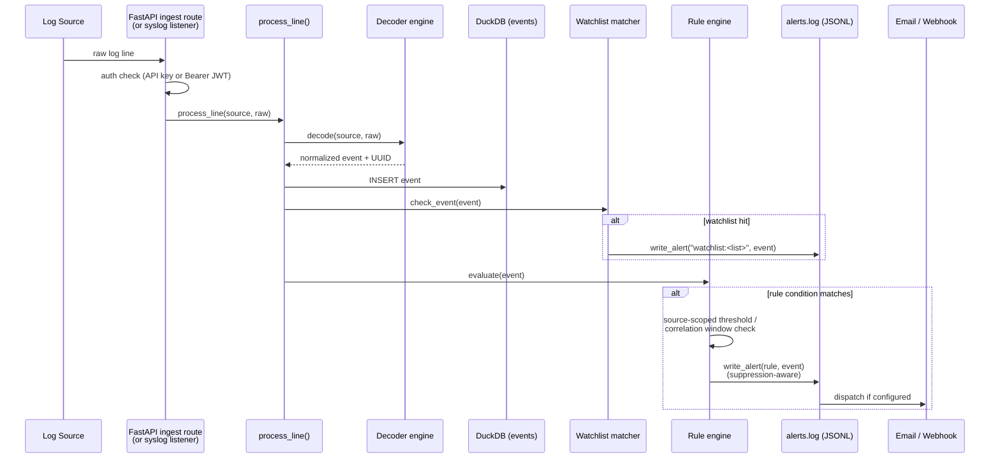
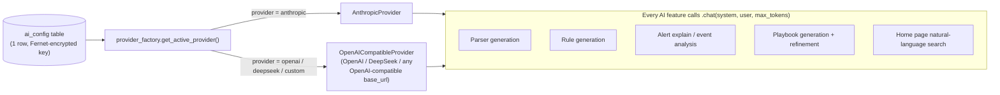
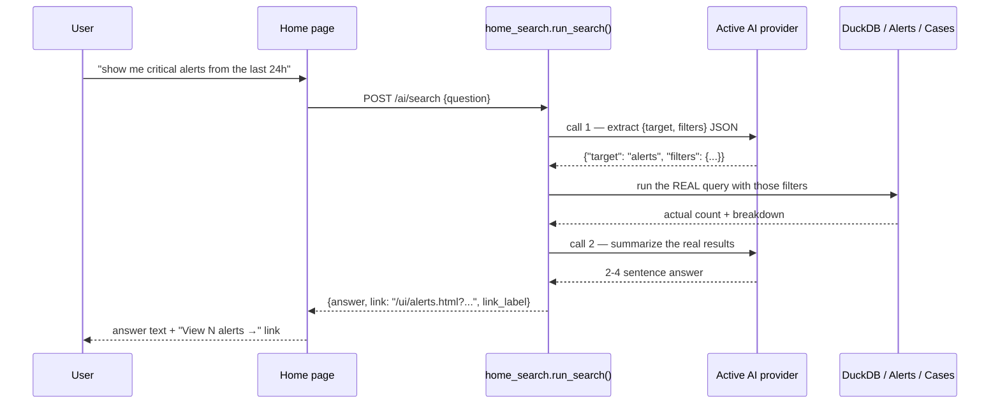
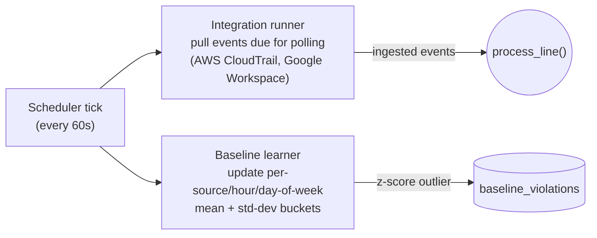

# Architecture

A high-level tour of how TinySIEM is put together: how a log line becomes an alert, how the pieces talk to each other, and where each subsystem lives in the codebase. For the exhaustive file-by-file layout and dev workflow, see [Development](development.md).

---

## System Overview

TinySIEM is a single FastAPI application, a single DuckDB database, an append-only alert log, and a set of self-contained static HTML/JS pages — all served from one Docker container behind nginx. There is no message queue, no separate database server, and no build step for the frontend.

**Why this shape:** a small SOC team doesn't need Kafka or Elasticsearch. DuckDB gives fast analytical queries over a single embedded file; the JSONL alert log is human-readable, greppable, and trivially backed up; and a single-process FastAPI app means one `docker-compose up` and no service mesh to reason about.

---

## Request Lifecycle: Log Line → Alert

This is the path every ingested log line takes, regardless of which door it came in through (REST, syslog, or a pull integration).

A few details worth knowing:

- **One shared pipeline.** `app/ingest/pipeline.py::process_line(source, raw, strict=True)` is the single entry point for HTTP ingestion, the syslog listener, and the Beats endpoint. There's exactly one place where "raw line → stored event" happens, which is why a decoder or a security fix applies everywhere at once. `strict=False` (used by Beats/syslog, where a matching decoder isn't guaranteed) stores a minimal raw event instead of dropping the line.
- **Decoders are YAML, hot-reloaded.** Built-in decoders live in `app/decoder/decoders/*.yaml`; drop a file into `app/decoder/decoders/custom/` and it's picked up without a restart. Same pattern for rules (`app/rules/rules/` and `app/rules/rules/custom/`).
- **Watchlist hits and rule hits both become alerts through the same writer.** `app/alerts/file_writer.py::write_alert()` is the only thing that appends to `alerts.log` — a watchlist match just synthesizes a fake rule (`watchlist:<list_name>`) and calls the same function a detection rule would.
- **Self-monitoring is the same pipeline, recursed exactly once.** Security-relevant audit events (failed logins, lockouts, user/integration changes) are re-ingested as source `tinysiem_internal` via `app/audit/security_feed.py`, so the ordinary rule engine — including a built-in brute-force rule — can fire on attacks against TinySIEM itself. The feed only acts on an explicit allowlist of event types and never calls back into the audit logger, so there's no infinite loop.
- **Rules are source-scoped.** A `threshold` rule counts matching events only within its own declared `source` (unless it's the wildcard `*`), so the self-monitoring rule counting `tinysiem_internal` failed logins can't be tripped by unrelated nginx 401s.

---

## Storage

Everything durable lives in one of two places:

| What | Where | Notes |
|---|---|---|
| Normalized events | DuckDB `events` table | The core searchable store — what Events/Alerts/Cases/Entities all query against. |
| Alerts | `alerts.log` (JSONL, append-only) | Not in DuckDB. Rotated at a configurable size. Per-alert *triage state* (status, assigned-to) lives separately in DuckDB's `alert_triage` table and is merged in at read time. |
| Everything else | DuckDB | Cases, case↔alert/event links, case comments, playbook steps, users, audit log, baselines + violations, watchlist entries, saved searches, rule exceptions, integrations + run history, per-user dashboards, and the single-row AI provider config. |

A single global DuckDB connection is guarded by one `threading.Lock()` (`app/storage/duckdb_store.py`) — every query holds it. This is a deliberate simplicity trade-off for a tool sized for small teams, not a high-concurrency analytical workload. See [Development → Key Implementation Notes](development.md#key-implementation-notes) for the specific DuckDB version quirks this constrains (e.g. tables that receive `UPDATE` can't also have a secondary index).

Cases can link to **both alerts and events** (`case_alerts` and `case_events` tables) — an analyst can escalate straight from an interesting raw event, not only from a fired alert.

---

## Detection

The rule engine (`app/rules/engine.py`) supports three condition types, each doing something a single regex match can't:

- **`field_match`** — a direct comparison on one field of one event (`status_code eq 500`).
- **`threshold`** — N matching events from the same source within a time window (brute-force, spike detection).
- **`correlation`** — a multi-step sequence across different event shapes within a window (e.g. "5 failed logins *then* one success" — the flagship example rule).

Rules are plain YAML with an optional `mitre_tactic`/`mitre_technique` tag and an optional embedded `playbook:` block (structured response steps, either hand-written or AI-generated). The Rules UI page includes a **backtest** feature — "what would this rule, as currently written, have fired on in the last N days?" — that runs against real historical events without touching the live rule set, so you can tune a threshold before saving it.

Every alert can be individually **suppressed**: repeated firings of the same rule against the same source IP within a window collapse into one alert with a running `suppressed_count`, instead of flooding the alert list.

---

## AI Layer (Optional)

AI is entirely optional and off by default — nothing in ingestion, detection, or alerting depends on it. When configured (Settings → AI Config, admin role), one active provider serves every AI-powered feature through a single abstraction:

Because every provider exposes the same one-shot `chat(system, user, max_tokens) → ChatResult` interface, adding a new AI-compatible backend later means implementing one small class, not touching five features. Every AI call is logged to the audit trail (prompt/response previews, duration, model) regardless of which feature triggered it.

**Home search is the most involved consumer**, since the provider interface has no tool-use/function-calling: a natural-language question is turned into a real answer via three sequential calls, not one.

If no provider is configured, or the provider call fails, the Home page falls back to a plain message plus manual links to Events/Alerts/Cases — it never blindly redirects, since a redirect alone would throw away whatever intent the question expressed.

---

## Cases and the Analyst Workflow

Cases are the unit an analyst actually works: created from scratch, from an alert, or from a raw event, then built up with linked alerts/events, comments, and (for correlation-rule alerts) a playbook of response steps. Status moves `open → investigating → resolved`, with a required resolution classification (`true_positive` / `false_positive` / `benign` / `undetermined`) on close.

The **Entity pivot** view (click an IP in Events/Alerts/Cases) is a thin read-only aggregation layer over the same data — first/last seen, event volume histogram, top methods/URIs/status codes, and every alert and case already associated with that IP — rather than its own separate feature with its own storage.

---

## Background Jobs

Two asyncio jobs run on a fixed interval alongside request handling, both started in `app/main.py`'s lifespan:

Pulled integration events flow through the exact same `process_line()` pipeline as everything else — an AWS CloudTrail record gets decoded, stored, watchlist-checked, and rule-evaluated identically to a line POSTed by curl. The baseline learner is a separate, lighter-weight statistical model (Welford's online algorithm) that flags **volume anomalies** per source rather than matching specific field patterns, complementing the rule engine rather than replacing it.

---

## UI and Navigation

Every page under `ui/` is a single self-contained HTML file — vanilla JS and CSS, no framework, no build step, self-hosted fonts, zero external network requests at runtime. A shared `nav.js` renders the identical top nav bar (Dashboard · Events · Alerts · Cases · Rules · Parsers) on every page and highlights the active item from `location.pathname`; **Settings** and **Audit Log** (superadmin-only) are reachable only from the profile dropdown, not the top nav, to keep the primary bar focused on daily analyst work. Settings itself is one page with ten tabs (Instance, Users & Access, Notifications, Retention, Ingestion, Baselines, Integrations, Sources, Reports, AI Config) rather than ten separate pages.

The Home page (`/`) is the AI natural-language search landing page, not a dashboard — the configurable widget dashboard lives at its own `dashboard.html`.

---

## Security Model

Role-based access control with three tiers — `analyst` < `admin` < `superadmin` — enforced per-endpoint via FastAPI dependencies (`require_analyst`, `require_admin`, `require_superadmin`). Two credential types exist for two different callers: a single global **API key** scoped only to `/ingest/*` (for log shippers that shouldn't need a human login), and per-user **JWTs** (HS256) for everything else, obtained via `POST /auth/login`. Session invalidation doesn't require a token blocklist — every user carries a `token_epoch` that's bumped on password change, logout, or an admin-driven update, instantly rejecting any previously-issued token for that user on its next request. See [Configuration → Security Checklist](configuration.md#security-checklist) for the full hardening surface (lockout, CSP, TLS, startup guardrails, etc.).

---

## Where Things Live

For the exhaustive module-by-module and file-by-file breakdown — every router, every DuckDB table, every UI page, and the implementation gotchas that don't fit a diagram — see [Development](development.md).
